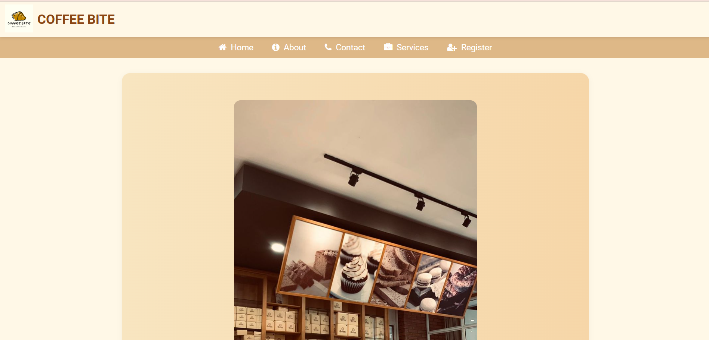
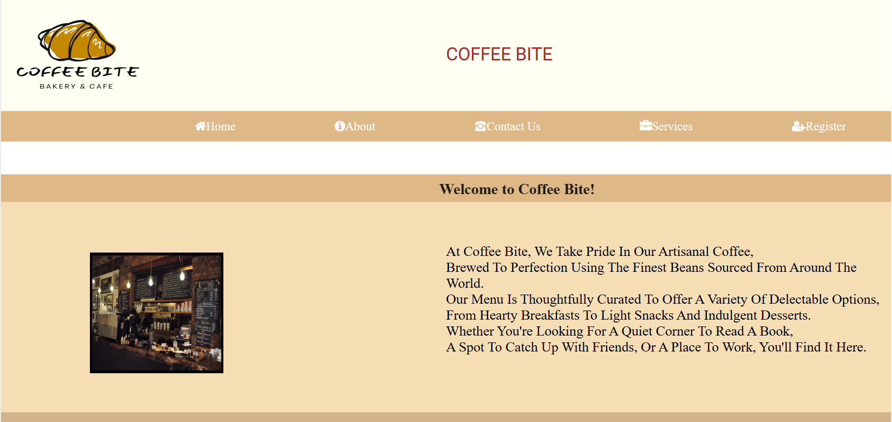
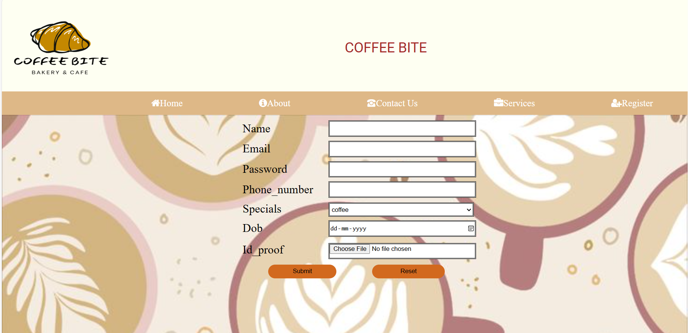
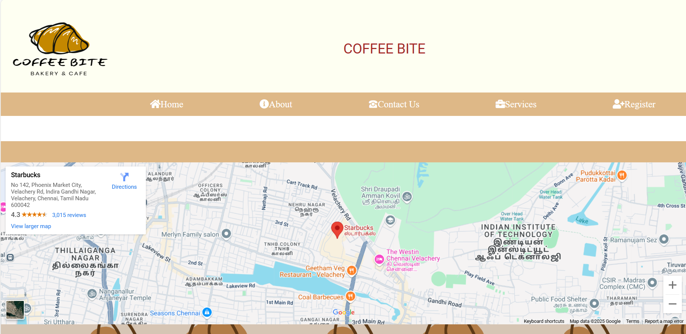

# ☕ Coffee-Bite Cafe Website

## 📌 Overview
**Coffee-Bite** is a stylish and modern cafe website built using **HTML**, **CSS**, and **PHP**.  
This project showcases an elegant UI to display menu items, cafe details, and provides users with the ability to **register** or **contact** the cafe. Built for learning full-stack web fundamentals and developing beautiful, responsive websites.

---

🌐 **Live Website**  
🚀 Coming Soon...

---

## 🎯 Features
- 🏠 **Home Page:** Clean landing page with attractive visuals
- 📖 **About Page:** Know more about Coffee-Bite
- ☕ **Menu/Services Page:** Display menu items with images
- 📝 **Register & Join Page:** Basic PHP form to collect user data
- 📬 **Contact Page:** Connect with the cafe for inquiries
- 📑 **Modular Components:** Separate header and footer for easy reuse

---

## 🖥️ Tech Stack
- 🌐 **Frontend:** HTML, CSS
- 🗂️ **Backend:** PHP
- 🗄️ **Database:** MySQL
- 🖥️ **Local Server:** XAMPP

---

## 🖼️ Screenshots

📌 **Home Page**  
*Clean landing page with attractive visuals.*  

📌 **About Page**  
*Know more about Coffee-Bite.*  

📌 **Service Page**  
*Display menu items with images.*  

📌 **Register Page**  
*User registration form to join Coffee-Bite.*  

📌 **Contact Page**  
*Connect with the cafe for inquiries.*  

---

## 🚀 Future Plans
- 🍽️ **Online Ordering Feature**
- 🗂️ **User Login & Profile Management**
- 🛒 **Shopping Cart for Orders**
- 📬 **Automated Email Confirmations**
- 📈 **Order Analytics Dashboard for Admin**

💡 *Stay tuned for updates!* 🎉

---

## 📬 Contact & Feedback
📧 [devisarunadevidd@gmail.com](mailto:devisarunadevidd@gmail.com)  
🔗 [GitHub Profile](https://github.com/devisarunadevid)

---

✨ *Made with ❤️ by Devis Aruna Devi D*
